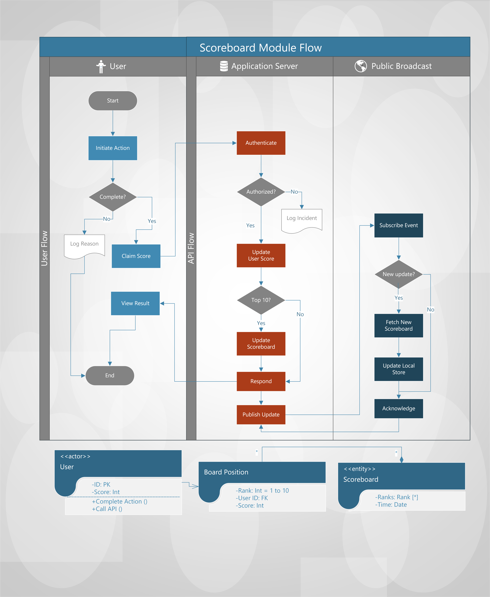

# Scoreboard Module
## Technical Specifications

### Overview
Architecture documentation to answer Problem 6 from 99 Tech's technical challenge.

This provides a preliminary technical specification for a proposed architecture and according flow of the module on a high-level perspective, as well as
suggestion on how to implement some aspects of a software module to meet requirements. Note that the goal is for demonstration
of my skills so it is by no means thorough as a real documentation of this scope should be.

Specifically, the module is to serve three main purposes:

1. provide an UI for user to gain points as reward for
completing certain actions
2. provide an API to serve such requests from the UI by updating the user's score which is persisted along with other user data
3. maintain and publish a running live scoreboard to announce the current top 10 scorers.

### Module Structure
In accordance with those functionalities, the module is thus divided into three loosely coupled components,
each pertaining to a separate application layer.
Refer to the following diagram for visualization of the architecture, or 
see the [PDF version](diagram.pdf).

 

### Data Models

See the accompanying UML class diagrams for suggestion on how to structure the data necessary
for maintaining such functionalities and cross-relations among the actors and systems.

#### User Model

A regular user model whose typical attributes (profile, preferences)
are omitted from the diagram for simplicity. The only important attribute
to add for this module to work is the `score` field. The application server
is responsible for increasing this score and persists the change at the backend whenever the user sends a valid claim request to the API
via the UI, after they have completed an action.

#### Scoreboard Model

One simple approach to maintain the scoreboard is to programmatically query the database
for the top scorers then return the results on every request, so no need to maintain another table for such data.
However, this may raise performance issues especially when the number of users
and the frequency of actions become high enough; database query is an expensive operation in terms of time and resource comsumption,
which is not worth repeating again and again for just a small subset of data like the scoreboard. 
For that reason, a more time-efficient approach is recommended as presented in the diagram: storing
the running scoreboard data in separate tables. The API flow to implement this might be as follows:

- On receiving an API call claiming points from a user, the server first validates the claim to determine the validity and value of the claim.
- The security layer of the server also authenticates and/or authorizes the request to ensure the user is entitled to be rewarded (such as those assigned a "`Rewardable`" role in the ACL).
This step is very important to prevent malicious attacks on the scoring system.
- Past authentication, the backend then rewards the user by increasing their `score` field by the determined value.
- The score is then checked if it reaches top 10. If not then no more need to deal with the scoreboard, just skip to last step (finishing request)
- If top 10, the backend then creates a `Board Position` record for each top scorer, which includes essentially a foreign key to track the user ID, and the score
- This ordered list of records is then inserted into the `Scoreboard` table whose each entry is basically a snapshot of the current scoreboard, with timestamp added.
- The API then finishes the request and responds to the UI client, reporting the result.

Storing extra data like this may seem redundant, but it provides two great benefits:

1. Getting the current scoreboard at any instant is now very efficient: just fetch
the latest record from the `Scoreboard` table, instead of querying the whole database to pick out the top 10!
2. The records are only used for a short time until it becomes stale (new users appearing in top 10 replacing all data),
but they are still useful in the future, serving as a history for tracking and archiving if needed.

### Scoreboard Broadcast
One of the requirements is for the system to publish live update of the scoreboard publicly. This is presented as another component
in the diagram. This can be implemented server-side by a Push-model PubSub system, a Web native real-time messaging
platform like Websocket, Server Event, GraphQL subscriptions, or 3rd-party cloud messaging services like Firebase.

### Conclusion
This documentation has presented a high-level view of a viable architecture for the module to work as required.
Some insights and suggestions are also provided to help the backend team aim in the right track
to find a good and performant implementation that solves the problem well. Please review, brainstorm and send your feedback, which will be valuable
to improve it. Thank you for your attention.

